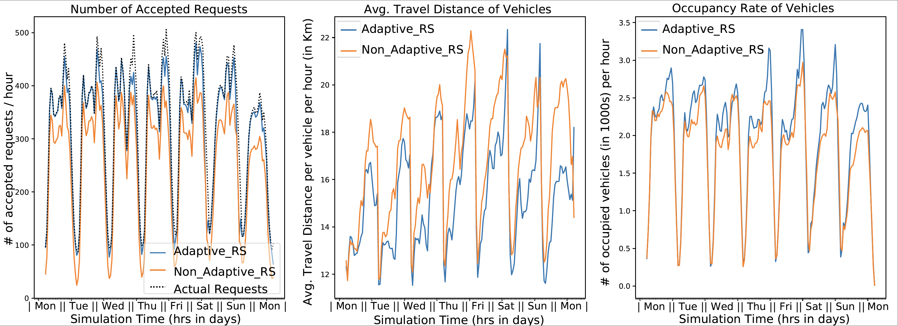
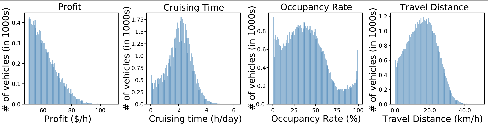

# DRSP-Sim: A Simulator for Dynamic Ride-Sharing with Pooling: Joint Matching,Pricing, Route Planning, and Dispatching

Marina Haliem, Vaneet Aggarwal, Bharat Bhargava, "DRSP-Sim: A Simulator for Dynamic Ride-Sharing with Pooling: Joint Matching,Pricing, Route Planning, and Dispatching", Under Review at Journal of Open Source Software (JOSS).

## Simulator Documentation and Flexibilities
DRSP-Sim supports pooling, which allows vehicles to pickup more than one customer at the same time. This adds more complexities to the ridesharing scenario where the route planning needs to be optimized to accommodate all customers. Matching, pricing, and dispatching algorithms need to be devised such that they take pooling into consideration. This simulator (1) provides a real-time Dynamic RideSharing simulator with Pooling (DRSP-Sim) for evaluating ridesharing algorithms integrated into one simulator, and (2) provides benchmarks for vehicle-customer matching, route planning, pricing and dispatching to test a wide range of scenarios encountered in the real world. Our work enables real-time evaluations and provides guidance for designing and evaluating future ridesharing algorithms.

## Getting Started (Simple Usecase)

### Setup
First, install Python 3.7. For development, we recommend cloning the simulator and installing the development dependencies using:
```commandline
git clone https://github.itap.purdue.edu/Clan-labs/Dynamic-RideSharing-Pooling-Simulator

pip install -r requirements.txt
```
### Input Data
Download the pre-processed data files directly from: https://purr.purdue.edu/publications/3843/1, load them into a directory, and set the DATA_DIR variable in config/settings.py to this directory. The steps to generate these files from scratch are also provided below.

For a quick start, you can set the number of simulation days to 1 to run only one day of simulation in simulator/settings.py:
```commandline
flags.DEFINE_integer('days', 1, "simulation days")
```

## Simulator Setup and Flexibilities
First step is set some variables the path to the sqlite database in config/settings as db_dir = "data/db.sqlite3". Also, set the path to the directory to which logs should be stored as DEFAULT_LOG_DIR = "logs/tmp".  

For the routing service, the user can choose to either use the OSRM server for real-time routing, or use our FastRouting service using pre-computed routes over the city. If the user chooses to use OSRM, this can be set in simulator/settings using: flags.DEFINE_boolean('use_osrm', False, "whether to use OSRM"). In this case, the host port for connecting needs to be set at config/settings.py as OSRM_HOSTPORT = os.getenv("OSRM_HOSTPORT", "localhost:5000").

After that, there is a number of variables in simulator/settings.py that provide wide flexibilities for the user to conduct a wide-range of experiments such as:

### 1. Whether to enable pooling: 
	flags.DEFINE_boolean('enable_pooling', True, "Enable RideSharing/CarPooling")
	
### 2. Whether to use our pricing benchmark: 
	flags.DEFINE_boolean('enable_pricing', True, "Enable Pricing Novelty")
If this is set to False, the simulator will default to the Pooling Pricing explained in our manuscript.
	
### 3. Set the number of vehicles to be involved in the simulation: 
	flags.DEFINE_integer('vehicles', 8000, "number of vehicles")
	
### 4. Among these vehicles, the user can set how many of them to adopt the DQN dispatching policy and how many of them to just go the destination-driven dispatching using these 2 variables:
	flags.DEFINE_integer('dummy_vehicles', 0, "number of vehicles using dummy agent")
	flags.DEFINE_integer('dqn_vehicles', 8000, "number of vehicles using dqn agent")
	
### 5. The user can also choose to log the events associated with vehicles or not using:  
	flags.DEFINE_boolean('log_vehicle', False, "whether to log vehicle states"). 
The customer-related events are being logged by default. These logs can then be parsed to generate plots of the relevant metrics by running:
```commandline
python parse_results.py
```
This invokes the plotting functions in tools/log_analyzer.py 
	
### 6. There is also multiple variables that are related to the DQN policy as well as the training hyper-parameters such as:
```commandline
	MAX_MEMORY_SIZE 	  		# Number of replay memory the dummy_agent uses for training.
	SAVE_INTERVAL 		  		# The frequency with which the network is saved.
	TARGET_UPDATE_INTERVAL 	# The frequency with which the target network is updated.
```
### 7. In addition to variables involved in calculating the reward function:
```commandline
	WORKING_COST = 0.2
	DRIVING_COST = 0.2
	STATE_REWARD_TABLE = {
    		status_codes.V_IDLE : -WORKING_COST,
    		status_codes.V_CRUISING : -(WORKING_COST + DRIVING_COST),
    		status_codes.V_ASSIGNED : -(WORKING_COST + DRIVING_COST),
    		status_codes.V_OCCUPIED : -(WORKING_COST + DRIVING_COST),
    		status_codes.V_OFF_DUTY : 0.0}
```
### 8. There is also various variables available in config/settings.py that related to the construction of  the region  graph  relying  on  the  New  York  city  map,  obtained  from  Open-StreetMap such as:
	1. The minimum and maximum time allowed between dispatching:
	 	MIN_DISPATCH_CYCLE
		MAX_DISPATCH_CYCLE
	2. Map-related variables such as:
		CENTER_LATITUDE
		CENTER_LONGITUDE
		LAT_WIDTH
		LON_WIDTH
		MAP_WIDTH = int(LON_WIDTH / DELTA_LON) + 1
		MAP_HEIGHT = int(LAT_WIDTH / DELTA_LAT) + 1
### 9. Switching between training and testing modes:
```commandline
flags.DEFINE_boolean('train', True, "run training dqn_agent network."). 
```
This variable should be set to False in the testing mode.

### 10. Finally, after setting all releveant paths, add the full path to the repo directory in simulator_driver.py:
```commandline
import sys
sys.path.insert(0, '..../Dynamic-RideSharing-Pooling-Simulator/')
```
### 11. Running the simulator:
```commandline
python simulator_driver.py
```

## Post-Processing and Plot Generation
The path to where logs will be stored can be set in config/settings.py:
```commandline
DEFAULT_LOG_DIR = "logs/tmp"
```
In addition, a tag can also be set to distihguish logs related to different experiments in simulator/settings.py:
```commandline
flags.DEFINE_string('tag', 'tmp', "tag used to identify logs").
```
### Interpretting the Results
After the logs has been stored during training or testing, they can be parsed to generate plots of the metrices of interest:
```commandline
python parse_results.py
```
This functionality is pretty flexible too, this file invokes the plotting functions in tools/log_analyzer.py, which could be altered as needed to monitor any metrics that might be relevant to the experiment. By default this file will generate plots corresponding to the directory specified under 'config/settings.py' using the 'DEFAULT_LOG_DIR' parameter, where sim logs are present. If the user decides to comapre more than one experiment against each other, the paths to the additional experiments will need to be provided as well. This can be passed as a list of paths to the plot_summary() function as follows:
```commandline
def plot_summary(self, paths, labels, plt):
	"""Plotting of experiment summaries
        Args:
            paths:      (list) List of paths of all experiments which are to be plotted.
            labels:     (list) Names for each of the respective experiments.
            plt:        (matplotlib.pyplot) matplotlib object to write the plot onto???
        Returns:
            plt:        (matplotlib.pyplot) The output plot.
        """
```
which is called in parse_results.py as:
```commandline
summary_plots = l.plot_summary([DEFAULT_LOG_DIR], ["Number of Accepted Requests", "Average Travel Distance", "Occupancy Rate of Vehicles"], plt)
```
Note that these functionalities can be altered as needed to monitor any metrics that might be relevant to the experiment.

A sample output is shown here:
<h1 align="center">Comparing two algorithms for the duration of simulation</h1>

<div align="center">  </div>

<hr>

<h1 align="center">Summary of Metrics for the simulation duration</h1>

<div align="center">  </div>

## Contributions and Development 
Contributions are always welcome! Please fork the repository and open a new pull request for any new features.

## Issues and Support

Please [file an issue on Github](https://github.com/marina-haliem/Dynamic-RideSharing-Pooling-Simulator/issues/new) if you run into any problems with the software.

## Data Generation
The user can choose to either go through the pre-processing steps mentioned below to generate the data, or just fetch the pre-processed files directly from:  https://purr.purdue.edu/publications/3843/1, load them into a directory, and set the DATA_DIR variable in config/settings.py

Below you will find step-by-step instructions to set up the NYC taxi simulation using 2016-05 trips for training and 2016-06 trips for evaluation. If you would like to simulate another city map (other than NY), you basically follow the same preprocesing steps but using the osm data of the required city as well as its corresponding trip data as well. 

### 1. Download OSM Data
```commandline
wget https://download.bbbike.org/osm/bbbike/NewYork/NewYork.osm.pbf -P osrm
```

### 2. Preprocess OSM Data
```commandline
cd osrm
docker run -t -v $(pwd):/data osrm/osrm-backend osrm-extract -p /opt/car.lua /data/NewYork.osm.pbf
docker run -t -v $(pwd):/data osrm/osrm-backend osrm-partition /data/NewYork.osrm
docker run -t -v $(pwd):/data osrm/osrm-backend osrm-customize /data/NewYork.osrm
```

### 3. Download Trip Data
```commandline
mkdir data
wget https://s3.amazonaws.com/nyc-tlc/trip+data/yellow_tripdata_2016-05.csv -P data/trip_records
wget https://s3.amazonaws.com/nyc-tlc/trip+data/green_tripdata_2016-05.csv -P data/trip_records
wget https://s3.amazonaws.com/nyc-tlc/trip+data/yellow_tripdata_2016-06.csv -P data/trip_records
wget https://s3.amazonaws.com/nyc-tlc/trip+data/green_tripdata_2016-06.csv -P data/trip_records
```

### 4. Build Docker image
```commandline
docker-compose build sim
```

### 5. Preprocess Trip Records
```commandline
docker-compose run --no-deps sim python src/preprocessing/preprocess_nyc_dataset.py ./data/trip_records/ --month 2016-05
docker-compose run --no-deps sim python src/preprocessing/preprocess_nyc_dataset.py ./data/trip_records/ --month 2016-06
```

### 6. Snap origins and destinations of all trips to OSM
```commandline
docker-compose run sim python src/preprocessing/snap_to_road.py ./data/trip_records/trips_2016-05.csv ./data/trip_records/mm_trips_2016-05.csv
docker-compose run sim python src/preprocessing/snap_to_road.py ./data/trip_records/trips_2016-06.csv ./data/trip_records/mm_trips_2016-06.csv
```

### 7. Create trip database for Simulation
```commandline
docker-compose run --no-deps sim python src/preprocessing/create_db.py ./data/trip_records/mm_trips_2016-06.csv
```

### 8. Prepare statistical demand profile using training dataset
```commandline
docker-compose run --no-deps sim python src/preprocessing/create_profile.py ./data/trip_records/mm_trips_2016-05.csv
```

### 9. Precompute trip time and trajectories by OSRM
```commandline
docker-compose run sim python src/preprocessing/create_tt_map.py ./data
```
The tt_map needs to be recreated when you change simulation settings such as MAX_MOVE.

### 10. Change simulation settings
You can find simulation setting files in `src/config/settings` and `src/simulator/settings`.


## © CLAN Labs, Purdue.

## Please cite the following papers if using any part of the code:

Marina Haliem, Ganapathy Mani, Vaneet Aggarwal, and Bharat K. Bhargava, "A Distributed Model-Free Ride-Sharing Approach for Joint Matching, Pricing, and Dispatching Using Deep Reinforcement Learning", IEEE Transactions on Intelligent Transportation Systems. @ARTICLE{9507388, author={Haliem, Marina and Mani, Ganapathy and Aggarwal, Vaneet and Bhargava, Bharat}, journal={IEEE Transactions on Intelligent Transportation Systems}, title={A Distributed Model-Free Ride-Sharing Approach for Joint Matching, Pricing, and Dispatching Using Deep Reinforcement Learning}, year={2021}, pages={1-12}, doi={10.1109/TITS.2021.3096537}}

Marina Haliem, Vaneet Aggarwal, and Bharat K. Bhargava, "AdaPool: A Diurnal-Adaptive Fleet Management Framework Using Model-Free Deep Reinforcement Learning and Change Point Detection," in IEEE Transactions on Intelligent Transportation Systems. @ARTICLE{9565816, author={Haliem, Marina and Aggarwal, Vaneet and Bhargava, Bharat}, journal={IEEE Transactions on Intelligent Transportation Systems}, title={AdaPool: A Diurnal-Adaptive Fleet Management Framework Using Model-Free Deep Reinforcement Learning and Change Point Detection}, year={2022}, volume={23}, number={3}, pages={2471-2481}, doi={10.1109/TITS.2021.3109611}}

Marina Haliem, Vaneet Aggarwal, and Bharat K. Bhargava, "Adapool:  An adaptive model-free ride-sharing approach for dispatching using deep reinforcement learning", In BuildSys’20. @inproceedings{HaliemAB20, author    = {Marina Haliem andvVaneet Aggarwal andvBharat K. Bhargava}, title = {AdaPool: An Adaptive Model-Free Ride-Sharing Approach for Dispatching using Deep Reinforcement Learning}, booktitle = {BuildSys '20: The 7th {ACM} International Conference on Systems for Energy Efficient Buildings, Cities, and Transportation, Virtual Event, Japan, November 18-20, 2020}, pages = {304--305}, publisher = {{ACM}}, year = {2020}, url = {https://doi.org/10.1145/3408308.3431114}, doi = {10.1145/3408308.3431114}}

Marina Haliem, Ganapathy Mani, Vaneet Aggarwal, Bharat Bhargava, "A Distributed Model-Free Ride-Sharing Algorithm with Pricing using Deep Reinforcement Learning", Computer Science in Cars Symposium, CSCS 2020. @inproceedings{10.1145/3385958.3430484, author = {Haliem, Marina and Mani, Ganapathy and Aggarwal, Vaneet and Bhargava, Bharat}, title = {A Distributed Model-Free Ride-Sharing Algorithm with Pricing Using Deep Reinforcement Learning}, year = {2020}, isbn = {9781450376211}, publisher = {Association for Computing Machinery}, address = {New York, NY, USA}, url = {https://doi.org/10.1145/3385958.3430484}, booktitle = {Computer Science in Cars Symposium}, articleno = {5}, numpages = {10} }

## Since this code uses codes developed in the papers below, please cite those too.

Abubakr Al-Abbasi, Arnob Ghosh, and Vaneet Aggarwal, "DeepPool: Distributed Model-free Algorithm for Ride-sharing using Deep Reinforcement Learning," IEEE Transactions on Intelligent Transportation Systems, vol. 20, no. 2, pp. 4714-4727, Dec 2019. @article{al2019deeppool, title={Deeppool: Distributed model-free algorithm for ride-sharing using deep reinforcement learning}, author={Al-Abbasi, Abubakr O and Ghosh, Arnob and Aggarwal, Vaneet}, journal={IEEE Transactions on Intelligent Transportation Systems}, volume={20}, number={12}, pages={4714--4727}, year={2019}, publisher={IEEE} }

A. Singh, A. Alabbasi, and V. Aggarwal, "A distributed model-free algorithm for multi-hop ride-sharing using deep reinforcement learning," IEEE Transactions on Intelligent Transportation Systems, Oct 2019 (also in NeurIPS Workshop 2019). @ARTICLE{9477304, author={Singh, Ashutosh and Al-Abbasi, Abubakr O. and Aggarwal, Vaneet}, journal={IEEE Transactions on Intelligent Transportation Systems}, title={A Distributed Model-Free Algorithm for Multi-Hop Ride-Sharing Using Deep Reinforcement Learning}, year={2021}, pages={1-11},doi={10.1109/TITS.2021.3083740}}

T. Oda and C. Joe-Wong, "Movi: A model-free approach to dynamic fleet management," IEEE INFOCOM 2018. (Their code is available at https://github.com/misteroda/FleetAI ) @inproceedings{oda2018movi, title={MOVI: A model-free approach to dynamic fleet management}, author={Oda, Takuma and Joe-Wong, Carlee}, booktitle={IEEE INFOCOM 2018-IEEE Conference on Computer Communications}, pages={2708--2716}, year={2018}, organization={IEEE} }
